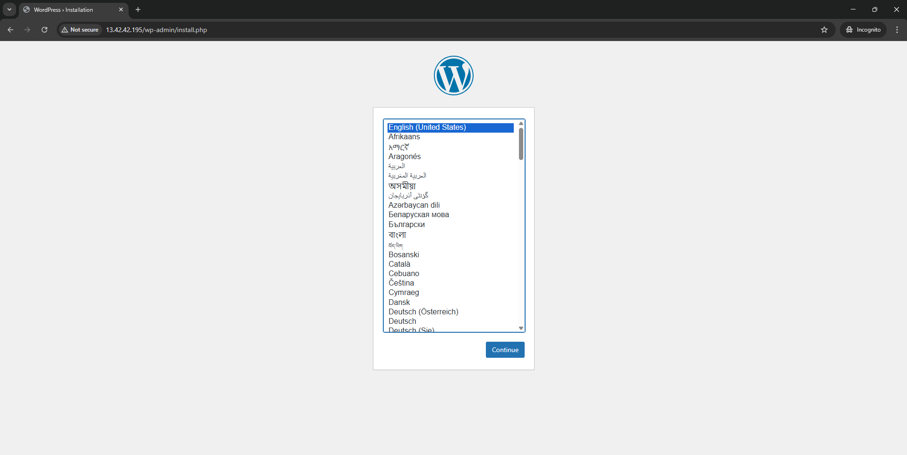

# Deploy WordPress Using Terraform

## Overview

This project demonstrates how **Terraform** can provision and manage a complete WordPress stack on AWS using Infrastructure as Code (IaC).

All infrastructure resources were created programmatically via Terraform, including compute, networking, security configuration, and automated application setup.

The result is a publicly accessible WordPress instance running on an EC2 virtual machine.

---

## Infrastructure Components

The deployment provisions the following AWS resources:

* **EC2 Instance (Ubuntu)**
* **Security Group**

  * HTTP (Port 80) open to the public
  * SSH (Port 22) restricted to a specific IP address
* **User Data Script** to automatically:

  * Install Apache, PHP, and MariaDB
  * Create the WordPress database
  * Download and configure WordPress
  * Enable and start required services
* **Public IPv4 Address**
* **Terraform Outputs**

  * Instance ID
  * Public IP
  * Public DNS
  * WordPress URL

All resources are defined declaratively and managed entirely by Terraform.

---

## Project Structure

```
terraform-assignment1/
│
├── main.tf
├── provider.tf
├── variables.tf
├── outputs.tf
├── terraform.tfvars
│
└── modules/
    └── ec2/
        ├── ec2.tf
        ├── sg.tf
        ├── variables.tf
        └── outputs.tf
```

---

## Deployment Instructions

### 1. Initialise Terraform

```bash
terraform init
```

### 2. Validate Configuration

```bash
terraform validate
```

### 3. Deploy Infrastructure

```bash
terraform apply
```

Terraform will provision the infrastructure and output the public endpoint for accessing WordPress.

---

## Application Verification

After deployment, the WordPress installer page is accessible via the public IP address generated by Terraform.

The screenshot below confirms:

* The EC2 instance is running
* Security group rules allow HTTP traffic
* Apache and PHP are functioning correctly
* WordPress was successfully installed via user data
* The application is publicly accessible

### WordPress Installation Screen



---

## Clean Up

To destroy all provisioned resources:

```bash
terraform destroy
```

---

## Key Learning Outcomes

* Infrastructure as Code using Terraform
* AWS EC2 provisioning
* Security group configuration
* Automated application deployment using user data
* Modular Terraform design
* Infrastructure lifecycle management

